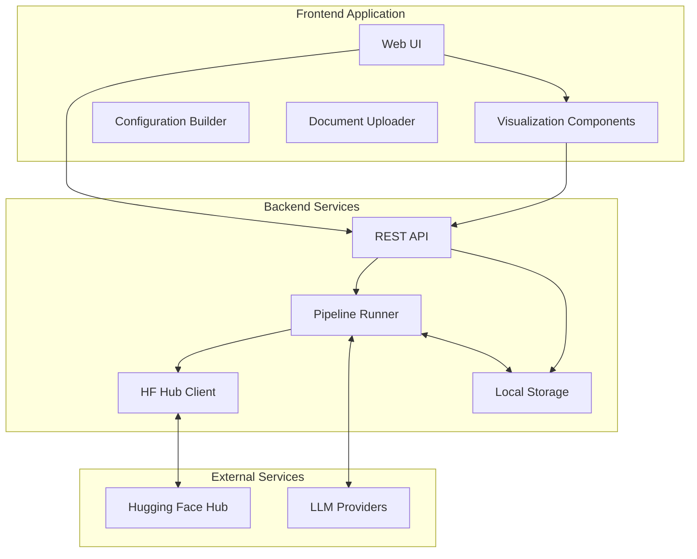
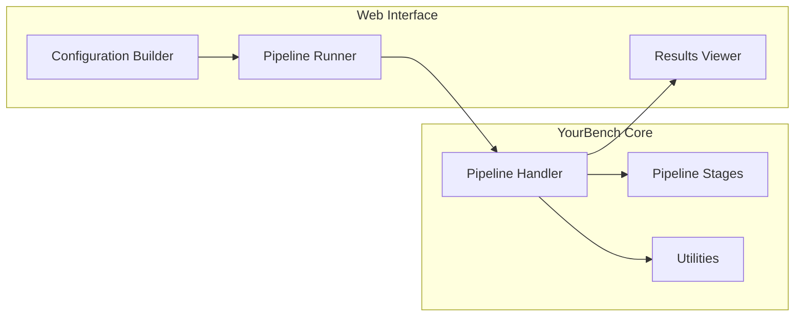
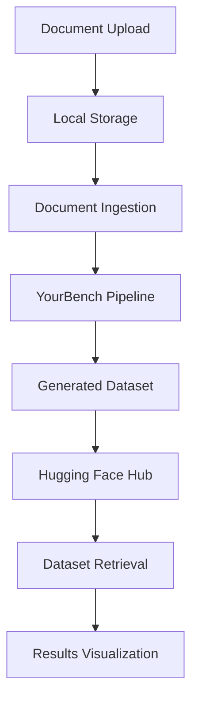

# YourBench Web Interface Development Plan

## Overview

This plan outlines the development of a web-based interface for YourBench that will allow users to:
1. Configure and run the YourBench pipeline through an intuitive web interface
2. Retrieve generated benchmark datasets from Hugging Face Hub
3. Visualize and explore the results locally in a web browser

## Architecture

## Components

### 1. Frontend Application

#### 1.1 Configuration Builder
- **Purpose**: Provide a user-friendly interface for creating YourBench configurations
- **Features**:
  - Form-based interface for all configuration options
  - Validation of configuration parameters
  - Templates for common use cases
  - Save/load configurations
- **Technologies**: React, TypeScript, Formik/React Hook Form

#### 1.2 Document Uploader
- **Purpose**: Allow users to upload source documents for benchmark generation
- **Features**:
  - Drag-and-drop interface
  - Support for multiple file formats (PDF, HTML, Word, text)
  - Progress indicators
  - File validation
- **Technologies**: React, TypeScript, React Dropzone

#### 1.3 Pipeline Monitor
- **Purpose**: Display real-time progress of the YourBench pipeline
- **Features**:
  - Stage-by-stage progress tracking
  - Log viewer
  - Error reporting
  - Timing information
- **Technologies**: React, TypeScript, WebSockets

#### 1.4 Results Visualization
- **Purpose**: Visualize and explore generated benchmark datasets
- **Features**:
  - Question browser with filtering and search
  - Difficulty distribution charts
  - Coverage analysis
  - Export options
- **Technologies**: React, TypeScript, D3.js/Chart.js, React Table

### 2. Backend Services

#### 2.1 REST API
- **Purpose**: Provide endpoints for frontend communication
- **Features**:
  - Configuration management
  - Pipeline execution
  - Results retrieval
  - User authentication
- **Technologies**: FastAPI, Python, JWT

#### 2.2 Pipeline Runner
- **Purpose**: Execute the YourBench pipeline with provided configurations
- **Features**:
  - Asynchronous execution
  - Progress reporting
  - Error handling
  - Resource management
- **Technologies**: Python, Celery, Redis

#### 2.3 HF Hub Client
- **Purpose**: Interact with Hugging Face Hub for dataset storage and retrieval
- **Features**:
  - Authentication with HF tokens
  - Dataset upload/download
  - Dataset search and filtering
  - Version management
- **Technologies**: Python, huggingface_hub

#### 2.4 Local Storage
- **Purpose**: Store configurations, documents, and results locally
- **Features**:
  - File system storage for documents
  - Database for configurations and metadata
  - Caching for performance
- **Technologies**: SQLite/PostgreSQL, Python

### 3. Deployment Options

#### 3.1 Local Deployment
- **Purpose**: Run the entire system on the user's machine
- **Features**:
  - Docker-based deployment
  - Simple setup script
  - Resource configuration
- **Technologies**: Docker, Docker Compose

#### 3.2 Cloud Deployment
- **Purpose**: Run the system in the cloud for better scalability
- **Features**:
  - Kubernetes deployment
  - Cloud storage integration
  - Horizontal scaling
- **Technologies**: Kubernetes, Helm, Cloud provider SDKs

## Implementation Plan

### Phase 1: Core Backend (4 weeks)

1. **Week 1-2: REST API Development**
   - Design API endpoints
   - Implement configuration management
   - Create authentication system
   - Develop document upload/management

2. **Week 3-4: Pipeline Integration**
   - Integrate YourBench pipeline
   - Implement asynchronous execution
   - Develop progress reporting
   - Create HF Hub client integration

### Phase 2: Frontend Basics (4 weeks)

3. **Week 5-6: Configuration UI**
   - Develop configuration builder
   - Implement validation
   - Create templates
   - Build document uploader

4. **Week 7-8: Pipeline Monitoring**
   - Create pipeline monitor UI
   - Implement real-time progress updates
   - Develop log viewer
   - Build error reporting

### Phase 3: Results Visualization (3 weeks)

5. **Week 9-10: Results Browser**
   - Develop question browser
   - Implement filtering and search
   - Create basic visualizations
   - Build export functionality

6. **Week 11: Advanced Visualizations**
   - Implement difficulty distribution charts
   - Create coverage analysis
   - Develop comparative visualizations
   - Build customizable dashboards

### Phase 4: Deployment and Testing (3 weeks)

7. **Week 12: Local Deployment**
   - Create Docker setup
   - Develop setup scripts
   - Write documentation
   - Test on different platforms

8. **Week 13-14: Testing and Refinement**
   - Conduct user testing
   - Fix bugs and issues
   - Optimize performance
   - Refine user experience

## Technical Considerations

### Integration with YourBench

- The web interface will use YourBench as a library
- Configuration created in the UI will be converted to YAML format
- Pipeline execution will be wrapped in an asynchronous task
- Progress reporting will be added to the pipeline handler

### Data Flow

- Documents uploaded through the UI will be stored locally
- YourBench pipeline will process the documents
- Generated datasets will be stored locally and optionally on HF Hub
- Results can be retrieved from local storage or HF Hub
- Visualization components will render the results in the browser

### Security Considerations

- User authentication for accessing the web interface
- Secure storage of API keys and tokens
- Input validation to prevent injection attacks
- Rate limiting to prevent abuse
- Secure communication with external services

## Future Enhancements

1. **Collaborative Features**
   - Sharing configurations and results with team members
   - Comments and annotations on questions
   - Version control for configurations

2. **Advanced Analytics**
   - Model performance comparison
   - Question quality metrics
   - Benchmark evolution over time

3. **Integration with LLM Evaluation Frameworks**
   - Export to popular evaluation frameworks
   - Integration with model leaderboards
   - Standardized evaluation protocols

4. **Custom Pipeline Extensions**
   - UI for creating custom pipeline stages
   - Plugin system for extensions
   - Community-contributed components